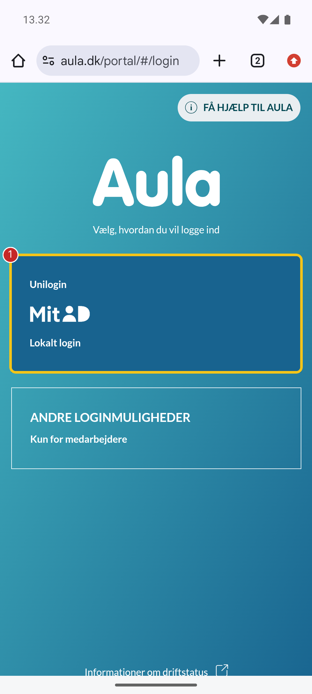
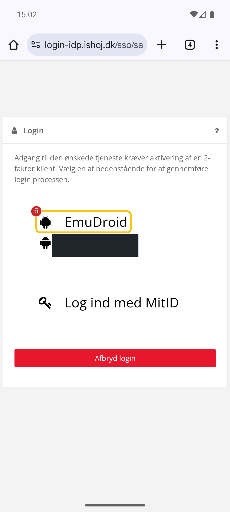
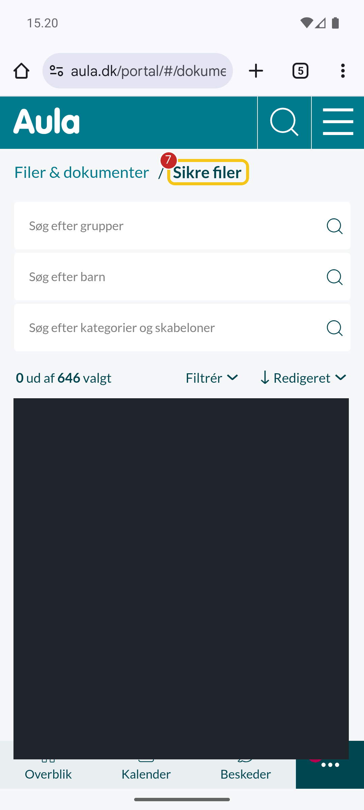

<div align="center">
	<h1>Guide Capture</h1>
	<p><strong>Reproducerbare Android-skærmbilleder til vejledninger — fanget, redigeret og annoteret automatisk</strong></p>
	<p>A capture pipeline that turns a JSON step specification into reviewed, redacted, annotated
	screenshots for documentation — without ever publishing a raw capture.</p>
</div>

<div align="center">

[](https://www.gnu.org/licenses/agpl-3.0)
[](https://www.gnu.org/software/bash/)
[](https://www.python.org)
[](https://developer.android.com/studio/run/emulator)

</div>

---

## 📖 Overview

Writing a step-by-step guide for a web service means taking the same screenshots over and over —
every time the UI changes, every time a step is added. Doing it by hand is slow, and doing it on a
real account means personal data leaks into the images.

Guide Capture automates the boring half and refuses to automate the dangerous half. You describe a
flow as a JSON specification; it drives a disposable Android emulator, captures each step, redacts
the regions you declared, draws numbered callouts, and stages the result for human review. Raw
captures never leave the machine.

It was built to document Danish municipal education services (Aula, OS2faktor, UniLogin), but
nothing about the pipeline is specific to those — a specification is just selectors and coordinates.

## 🖼️ What it produces

| Step 1 — pick login | Step 5 — redacted device list | Step 7 — redacted file listing |
|:---:|:---:|:---:|
|  |  |  |

Numbered callouts and highlight bounds come from the specification. The black rectangles are
declared redactions — a second enrolled device name in step 5, an entire secure-files listing in
step 7. Every output ships with an `annotation-report.json` recording SHA-256 hashes of both the
input and the output, so a reviewer can prove which raw capture produced which published image.

The full worked example lives in [`examples/`](examples/).

## 🔒 Security model

The pipeline assumes screenshots of a logged-in account are radioactive until proven otherwise.

- **Raw captures are never published.** They stay under `private/`, which is gitignored in full.
- **Secrets never appear in `argv`, logs, or screenshots.** Credentials are read from `private/.env`
  at execution time and piped directly into the device. `guide-capture` refuses to type a secret
  through its generic text command — `type-public` rejects any field the UI marks as a password, and
  rejects non-ASCII, spaces, and shell metacharacters.
- **No invented coordinates.** Every tap resolves an exact `text`, `content_desc`, or `resource_id`
  selector from a fresh UI hierarchy dump, and aborts on zero or multiple matches.
- **Human review is mandatory.** Every run is marked `human_review_required: true`. The tool stages
  output; it never publishes into a guides repository.
- **No overwriting.** An existing reviewed image or report must be removed explicitly.
- **Nothing bypasses device security.** Secure-window, integrity, attestation, and emulator-detection
  controls are respected; a screen that refuses to be captured stays uncaptured.
- **Commit-time guards.** `bin/check-sensitive-files` rejects credential-bearing paths from the
  index, and `prek` runs Gitleaks and a private-key detector on every commit.

The redaction and annotation rules a reviewer applies are documented in
[`skills/guide-capture/references/annotation-redaction.md`](skills/guide-capture/references/annotation-redaction.md).

## ⚙️ Requirements

macOS with Homebrew, plus:

```bash
brew install age zstd imagemagick jq node python@3.14
brew install --cask android-commandlinetools
```

The wrapper resolves tools from fixed Homebrew paths rather than `$PATH`, so a non-standard prefix
needs the constants at the top of `bin/guide-capture` adjusted.

An Android emulator image (the default profile targets a phone-sized AVD) and
[`prek`](https://prek.j178.dev) if you intend to commit.

## 🚀 Setup

```bash
git clone git@github.com:edbpede/guide-capture.git
cd guide-capture

mkdir -p private
cp .env.example private/.env
chmod 600 private/.env
$EDITOR private/.env          # fill in real values

prek install --hook-type pre-commit --hook-type commit-msg
bin/guide-capture doctor
```

`doctor` reports tool availability, port bindings, and directory permissions before you boot
anything.

## 📐 Workflow

The wrapper exposes one small verb per action rather than a single do-everything command, so each
step's result can be verified before the next one runs.

**1. Write a specification** in [`specs/`](specs/) — a slug, a start target, and an ordered list of
steps. Each step names a selector to tap, what to expect afterwards, and any redaction or annotation
bounds.

**2. Boot and open:**

```bash
bin/guide-capture doctor
bin/guide-capture boot android
bin/guide-capture open android https://example.dk
```

**3. Walk each step,** confirming exactly one visible match before acting, and shooting *before* the
tap so the image shows what to select:

```bash
bin/guide-capture wait  android '{"text":"Filer"}'
bin/guide-capture dump  android          # inspect the fresh hierarchy
bin/guide-capture shot  android 02
bin/guide-capture tap   android '{"text":"Filer"}'
bin/guide-capture wait  android '{"text":"Sikre filer"}'
```

Raw PNGs and UI dumps land in `private/runtime/raw-captures/<run-id>/`.

**4. Inspect the raw shots locally** for names, addresses, avatars, and device IDs, and record every
redaction region with its reason in the specification.

**5. Annotate:**

```bash
bin/guide-capture annotate specs/<name>.android.json
```

Redacts, annotates, strips metadata, and stages the result in `private/reviewed-output/<slug>/`.
Pass a retained run ID as a second argument to redo this offline — correcting bounds never requires
rebooting the emulator.

**6. Always shut down,** including after errors or skipped steps:

```bash
bin/guide-capture kill android
```

**7. Review and publish by hand.** Run the privacy-fit and target-fit passes over every staged image,
then copy only approved PNGs into your guides repository. The tool never publishes for you, and the
report and raw artefacts stay behind.

## 🗂️ Layout

```
bin/         wrapper (guide-capture) and the commit-time sensitive-path guard
lib/         Python image/selector pipeline and the Node DOM-tap helper
specs/       JSON step specifications
profiles/    emulator hardware profiles
skills/      agent-facing operating instructions for the pipeline
docs/        design notes, login flow, and phase validation records
examples/    a worked, reviewed output set
private/     gitignored: .env, emulator runtime, working output  (never published)
```

Set `GUIDE_CAPTURE_PRIVATE` to relocate `private/` off the repository entirely.

## 📄 License

[GNU AGPL v3](LICENSE) — © edbpede
